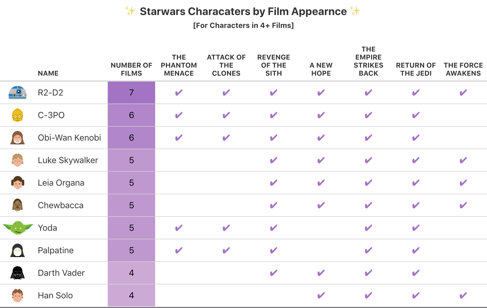

# Setting the Table
Table templates and examples

 

## gt Example

Use `dplyr` starwars characters tibble with 87 rows and 14 variables to generate a table with images and icons. 

  

 
 
## Formattable + Sparklines

 
 
